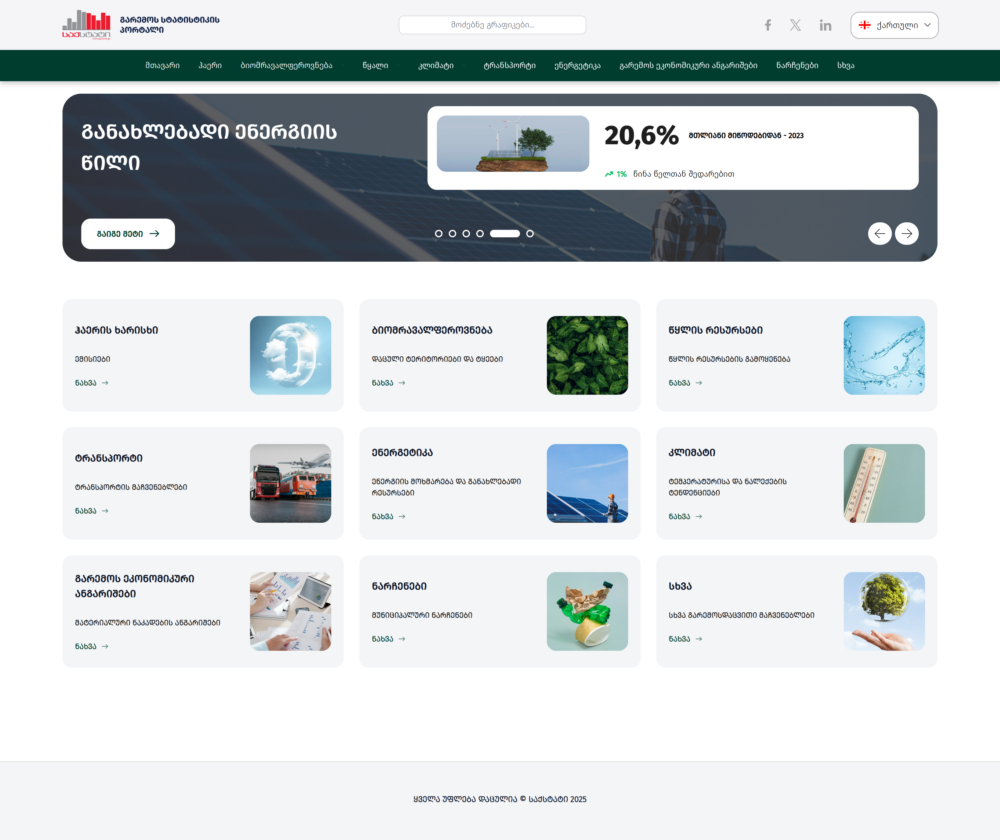

## ⚡ Project: Environmental Statistics Portal

**Environmental Statistics Portal – Georgia Edition** is a web-based platform that aggregates and visualizes **Georgia’s key environmental indicators** in real time. Explore trends in **air quality, biodiversity, water, climate, transport emissions, energy, waste**, and more — through interactive dashboards and intuitive charts.

Built for **policymakers, researchers, and the public**, it delivers **data-driven insights** into Georgia’s environmental performance in a clean, accessible format.

---

## ✨ Features

- 🔍 **Smart search** – find any indicator instantly
- 📊 **Interactive visualizations** powered by [Recharts](https://recharts.org/)
- 🗂️ **Thematic dashboards**: Air, Water, Climate, Energy, Waste, Biodiversity, Economic Accounts
- 📈 **Deep breakdowns**: by resource, time-series, balance tables
- 💾 **Export options**: PDF, Excel, JPG, PNG
- 🌐 **Bilingual interface**: Georgian (`/ge`) | English (`/en`)
- 📱 **Fully responsive** – seamless on mobile, tablet, desktop

---

## 🖼️ Screenshot



---

## 🚀 Live Demo

🔗 **[environment-statistics-portal.vercel.app](https://environment-statistics-portal.vercel.app/)**  
_(Toggle language in the top-right corner)_

---

## 📊 Data Sources

All data is sourced from **official Georgian institutions**, including:

- [National Statistics Office of Georgia (Geostat)](https://www.geostat.ge/en)
- [Ministry of Environmental Protection and Agriculture of Georgia](https://mepa.gov.ge/En)
- Other government agencies

---

## 🛠️ Tech Stack

- ⚛️ **Frontend:** [React](https://reactjs.org/)
- 📈 **Charts & Visualization:** [Recharts](https://recharts.org/)
- 🎨 **Styling:** [SCSS](https://sass-lang.com/)
- 🚀 **Deployment:** [Vercel](https://vercel.com/)

---

## 🔧 Getting Started Locally

```bash
git clone https://github.com/saba-bar95/environment.git
cd environment
npm install
npm run dev
```

### 👨‍💻 Author

[Saba Barbakadze – GitHub Profile](https://github.com/saba-bar95)
